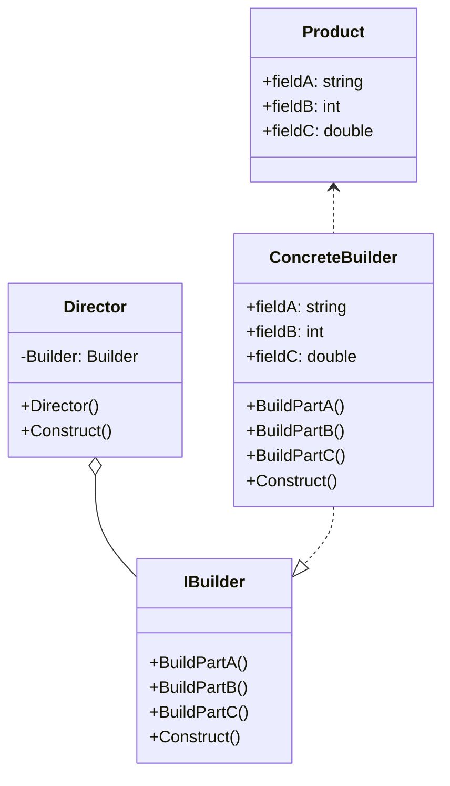
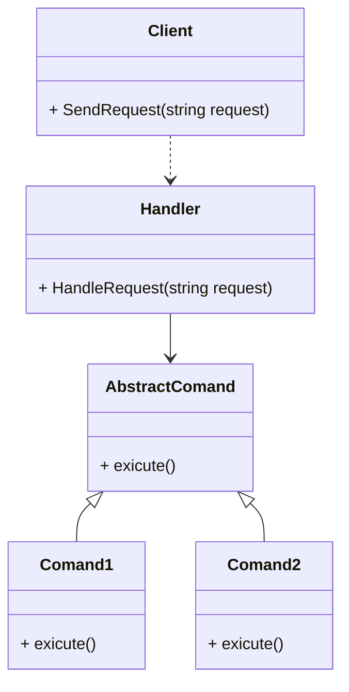
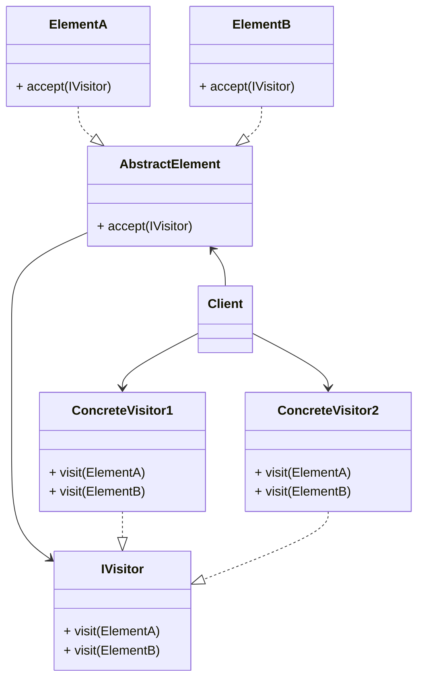
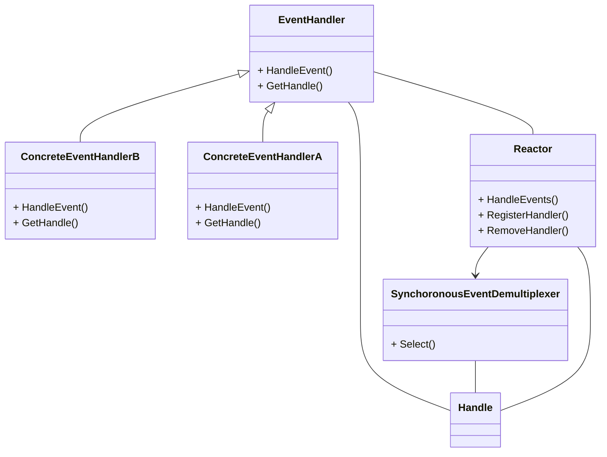

# Розрахунково-графічна робота

*з дисципліни «Архітектура та проектування ПЗ .NET»*

*На тему: «Шаблони проектування»*

**Мета роботи:** Вивчення стандартних ситуацій у процесі розробки складних програмних проектів та застосування шаблонів проектування (Design patterns) для їх вирішення.

## Builder

Будівельник (Builder) - шаблон проектування, який інкапсулює створення об'єкта та дозволяє розділити його на різні етапи. Іншими словами, ми даємо можливість створювати екземпляр класа іншому класу.

## Front Controller 

Вхідна точка (Front Controller) - це шаблон розробки програмного забезпечення, який міститься в кількох каталогах шаблонів. Шаблон відноситься до дизайну веб-додатків. Він «надає централізовану точку входу для обробки запитів».

## Hierarchical visitor 

Відвідувач(visitor) — це шаблон поведінкового проектування, який дозволяє відокремити алгоритми від об’єктів, з якими вони працюють

## Reactor

Reactor — це стратегія обробки подій, яка може відповідати на багато потенційних запитів на обслуговування одночасно. Ключовим компонентом шаблону є цикл подій, що виконується в одному потоці або процесі, який демультиплексує вхідні запити та відправляє їх правильному обробнику запитів.

